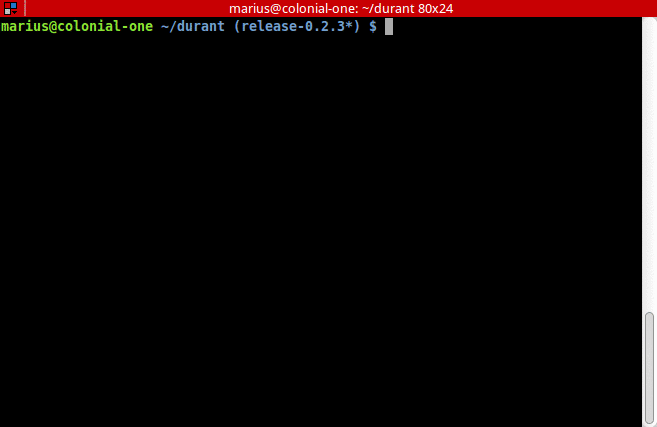
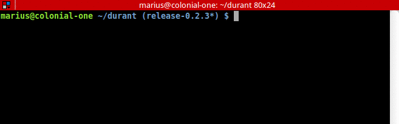

Durant
===============

What is it
------------------

Durant is a simple deployment tool for git repositories. It sends the files to servers using rsync over ssh. Basically, this means that you can use durant to deploy any kind of application, no matter the language used.

Latest version
------------------

Durant is a work in progress, currently in beta phase. Latest available version is 0.2.2.

Requirements
------------------

Linux operating system and:

* python (2.6, 2.7, 3.3, 3.4)
* git
* rsync

Installation
------------------

To install first make sure you have pip installed. Then simply run:

.. code-block:: bash

    $ pip install durant

This will install durant globally. If you want to install for your user only use the ``--user`` option and make sure that you have :code:`$HOME/.local/bin` added to your PATH:

.. code-block:: bash

    $ pip install --user durant

Usage
------------------

Configuration file
^^^^^^^^^^^^^^^^^^^^^

First thing you need to set up is a configuration file. This is needed in order for the tool to know what and where to do the deployments. The configuration is named :code:`durant.conf` and you have to place it in the root directory where your projects resides.

A sample config file is provided in this repository. You can define multiple stages to deploy to, each section of the config file representing a deployment stage. As you can see in the sample file, the structure follows the INI file format.

The first section of the file, called *DEFAULT*, holds general options such as the project's repository, files to exclude when deploying or the local path where to clone the project before performing the deploy.

.. code-block:: ini

    [DEFAULT]
    repository: /repository/path/or/url
    temp_dir: /local/directory/where/to/clone/before/deploy
    exclude: .git, .gitignore, .gitmodules

The sections that follow can be as many as your deployment stages are. For instance, in the case of the production stage one configuration section could look like the following:

.. code-block:: ini

    [production]
    server: example.com, 127.0.0.1
    user: username
    branch: master
    project_dir: /server/project/directory/root
    before_deploy: 
        composer install --no-dev --no-interaction --optimize-autoloader
        nosetests
        phpunit
        etc.

For each stage you can define the corresponding server, the username used when communicating via ssh, what branch to use, the project's root directory on the server or some commands to execute before deployment. Please note that each of these commands must exit with return code 0 or else the deployment considers that something went wrong and halts the process, thus failing.

Some of the options can take multiple values, like when declaring servers or before deploy commands. In such cases you can separate multiple values by using commas or by entering each value on a different line, properly indented.

Please note that the deploy process works best if you have already setup ssh authentication for your servers by defining hosts and authentication details using the :code:`~/.ssh/config` file. If you haven't, you can specify the identity key file to use when connecting to the server by using the *ssh_identity* option and also the *ssh_port* if you use a custom ssh port. 

Command line tool
^^^^^^^^^^^^^^^^^^^^^

After everything is setup you can start using the command line tool. As you may have guessed, you can invoke it by using the name ``durant``, from inside your project's root directory:

.. code-block:: bash

    $ durant [OPTIONS] deploy <stage>

If you want to test if the deploy process will perform well, without actually deploying to servers, you can specify the ``-n`` option in order to do a trial run.

.. code-block:: bash

    $ durant -n deploy <stage>

This will give a view of the files that will be modified. I **highly advice to use this option first** to check if everything will go as expected and not have any surprises. 

Examples
^^^^^^^^^^^^^^^^^^^^^

A successfully completed deployment may look like this:

In case something turns out wrong, a corresponding error is raised and the process is stopped:

Contribute
------------------

If you find any bugs please feel free to open a related issue. You can also send directly a pull request with the bug fix if you want (please use the current stable branch in this case).

Release History
------------------

Please see the file called `HISTORY.rst`_.

.. _HISTORY.rst: ./HISTORY.rst

Licensing
------------------

Please see the file called `LICENSE`_.

.. _LICENSE: ./LICENSE
